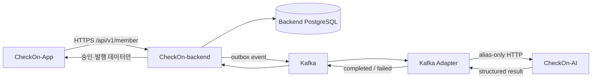
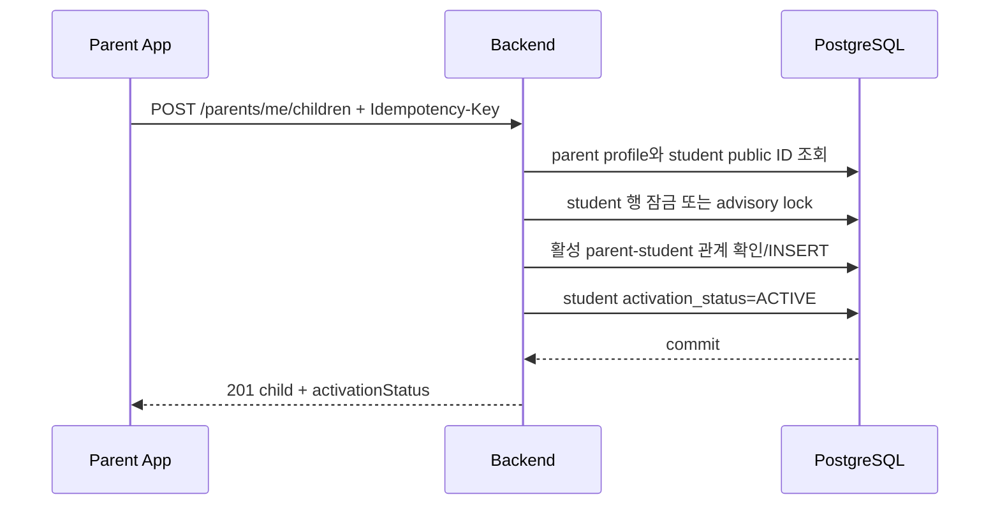
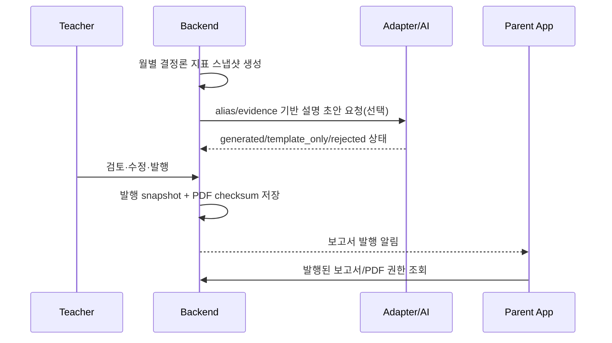
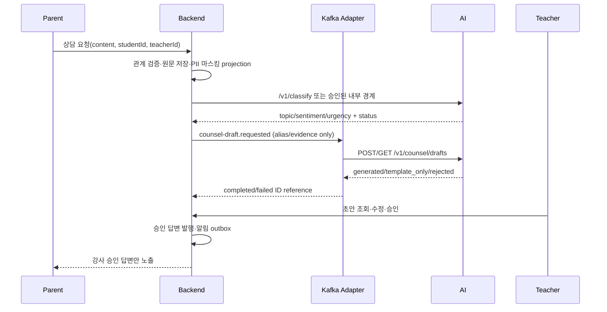

# CheckOn 학생·학부모 백엔드 및 API 연동 설계

> 상태: 구현 전 설계 기준안  
> 작성 기준일: 2026-08-24  
> 대상: `CheckOn-App` 학생·학부모 프론트, 공유 `CheckOn-backend`, `checkon-kafka-adapter`, `CheckOn-AI`  
> 핵심 제약: 기존 팀원 소유 파일은 수정하지 않고, 신규 파일 중심의 독립 패키지와 작은 공통 기반 PR로 작업한다.

## 1. 결론

학생·학부모 API는 공유 백엔드 안에 새 `com.checkon.member` 경계를 만들고, 일반 조회·저장·채점·관계 처리는 모두 `CheckOn-backend`가 소유한다. AI는 앱이 직접 호출하지 않으며, 위험 탐지·문제 생성·상담 초안처럼 이미 계약된 비동기 작업만 Kafka Adapter를 거친다.

MVP의 주요 결정은 다음과 같다.

- 학생은 가입 직후 로그인할 수 있지만 학습 기능은 `PENDING_PARENT_LINK` 상태로 제한한다.
- 학부모가 학생 공개 ID를 등록하면 학생이 `ACTIVE`가 된다.
- 학생은 여러 강사, 학부모도 여러 강사와 연결될 수 있다.
- 학생 한 명은 활성 학부모 계정 하나에만 연결된다.
- 학생 문제 채점, 풀이 시간, 월별 통계와 약점 개선도는 백엔드 결정론 코드가 계산한다.
- 전국 백분위는 산출하지 않는다. 같은 약점 셀의 전월 대비 정확도 변화(퍼센트포인트)를 사용한다.
- 정답과 해설은 제출 완료 전에는 어떤 학생 API에도 포함하지 않는다.
- 학부모 보고서는 강사가 확정·발행한 백엔드 스냅샷만 노출한다. AI 보고서 API를 학부모 앱이 직접 호출하지 않는다.
- 상담 분류·초안은 AI 보조 기능이다. 원문 저장, 강사 검토, 승인, 학부모 노출은 백엔드가 소유한다.

## 2. 검토 기준과 현재 사실

| 저장소 | 검토 기준 | 확인된 역할 |
| --- | --- | --- |
| `CheckOn-App` | `7a7db5d` + 현재 로컬 프론트 변경 | Next.js App Router, Gateway/DTO/Adapter, TanStack Query, Zustand 기반 mock/API 전환 구조 |
| `CheckOn-backend` | `dev`의 `906943a` | 계정/JWT, Roster, 학습 원본, 문제 생성·발행, 상담 AI 연동, PostgreSQL/RLS의 권위 원본 |
| `checkon-kafka-adapter` | `main`의 `64cebcb` | 위험 탐지·문제 생성·상담 초안의 durable Inbox/Outbox 및 AI HTTP 변환 |
| `CheckOn-AI` | 로컬 검토 시점 `b69837c` | alias 기반 위험 탐지, 문제 생성, 상담 분류·초안, 강사용 보고서 조립/편집 보조 |

현재 구현에서 반드시 보완할 사항:

1. V33은 관계 제약을 구현했지만 학생·학부모 self-access RLS는 없다.
2. `AuthenticatedAccount`는 `accountId`, `role`, `teacherProfileId`, `sessionId`만 가진다. 학생·학부모 프로필은 `accountId`로 새 member 패키지에서 해석해야 한다.
3. 기존 계정 상태는 `ACTIVE/WITHDRAWN/SUSPENDED`뿐이다. 학생 활성화 대기는 계정 상태가 아닌 학생 프로필의 별도 상태로 둔다.
4. 기존 `/api/v1/students/**`는 Security 설정에서 강사 전용이다. 학생 앱 API를 같은 경로로 만들면 권한 충돌이 난다.
5. 프론트는 `/v1/students/me`, `/v1/parents/me`를 예상하지만, 실제 연동 시 독립 경계를 위해 `/api/v1/member/...`로 Gateway 경로만 교체하는 것이 안전하다.
6. 프론트의 현재 문제 결과는 mock 단계에서 브라우저가 채점한다. API 모드에서는 서버 제출 응답으로 전환해야 한다.
7. AI `/v1/reports`는 현재 강사용 편집 경계이고 기본 저장소가 인메모리다. 월별 보고서의 운영 원장으로 사용할 수 없다.
8. Kafka Adapter의 문서 일부에는 상담 계약 미확정이라는 과거 설명이 남았지만, 코드와 V5/V6에는 상담 초안 worker가 존재한다. 운영 시 코드·배포 설정·최신 계약을 정본으로 다시 합의해야 한다.

## 3. 저장소와 소유권 경계

### 3.1 새 백엔드 패키지

기존 `account`, `roster`, `learning`, `problem`, `counsel`, `global` 내부 파일을 직접 수정하지 않고 아래 신규 경계에서 시작한다.

```text
src/main/java/com/checkon/member/
├── common/
│   ├── error/                 # member API 오류 코드·예외 변환
│   ├── security/              # /api/v1/member 전용 보안 체인, 주체 해석
│   ├── persistence/           # student/parent transaction-local RLS context
│   └── presentation/          # 공통 envelope, cursor page
├── auth/                      # 학생·학부모 가입, 활성화 상태 조회
├── membership/                # 자녀 등록, 강사 초대, 관계 조회
├── student/
│   ├── worksheet/             # 배정 학습지 조회
│   ├── attempt/               # 풀이 세션, 답안, 시간, 제출·채점
│   ├── question/              # 문제 질문·추가 질문·답변 조회
│   ├── record/                # 학생 학습기록 조회 모델
│   └── profile/               # 내 정보·알림 설정
├── parent/
│   ├── home/                  # 자녀별 홈 요약
│   ├── record/                # 학습기록 목록·상세
│   ├── analysis/              # 고급 분석·약점 개선도
│   ├── report/                # 발행 보고서·PDF 읽기
│   ├── consultation/          # 상담 요청·답변
│   ├── notification/          # 알림
│   └── profile/               # 내 정보
└── integration/
    ├── roster/                # 기존 관계·프로필을 읽는 어댑터
    ├── learning/              # 학습 원본 생성/조회 어댑터
    ├── problem/               # 발행된 문제 세트 스냅샷 조회
    └── counsel/               # 기존 상담/Adapter 경계 연결
```

각 기능 내부는 `presentation → application → domain ← infrastructure` 방향을 지킨다. Controller에서 기존 Repository나 다른 패키지 Entity를 직접 호출하지 않는다.

### 3.2 기존 도메인 접근 규칙

새 패키지의 application 계층에는 아래 출력 포트를 둔다.

```text
MemberAccountPort
RosterMembershipPort
PublishedWorksheetPort
LearningRecordPort
CounselAiPort
ReportPublicationPort
NotificationPort
Clock / IdGenerator
```

`member/integration/*`에서만 기존 패키지의 공개 Service/Repository에 접근한다. 상대 패키지 내부 타입을 member domain으로 전파하지 않고, adapter가 member 전용 immutable record로 변환한다.

기존 패키지에 공개 포트가 없어 수정이 불가피하면 기능 PR에 섞지 않는다. 팀원과 합의한 별도 공통 기반 PR에서 최소 인터페이스만 추가한다.

### 3.3 파일 충돌 방지 규칙

- 기존 Flyway 파일 V1~V33은 절대 수정하지 않는다.
- 새 migration 번호는 작업 시작 전에 Slack/이슈로 예약한다.
- `AccountSecurityConfiguration`, 기존 OpenAPI, 기존 Entity/Repository 수정은 기본 금지다.
- member 전용 보안 체인은 신규 `MemberSecurityConfiguration`으로 `/api/v1/member/**`만 `@Order(0)`에서 처리한다.
- 신규 API 명세는 우선 `member-api.yaml` 별도 파일로 둔다. 통합 문서는 릴리스 직전 공동 PR에서 합친다.
- 공통 변경은 한 PR에 한 주제만 포함하고 양쪽 담당자 승인 후 merge한다.
- 권장 CODEOWNERS: `member/**`는 학생·학부모 담당, `account/**`, `roster/**`, `global/**`, `db/migration/**`는 공동 리뷰.

## 4. 시스템 경계



금지 경로:

- 브라우저 → AI 직접 호출
- AI → Backend DB 조회
- Adapter → Backend DB 조회
- AI가 학부모에게 직접 발송
- 학부모 조회 시점에 장시간 AI 생성 호출
- 앱 API에서 원본 teacher ID를 테넌트 권한으로 신뢰

## 5. 인증과 학생 활성화

### 5.1 상태 모델

계정의 로그인 가능 여부와 학생의 서비스 사용 가능 여부를 분리한다.

```text
accounts.status: ACTIVE | SUSPENDED | WITHDRAWN
student_profiles.activation_status:
  PENDING_PARENT_LINK | ACTIVE | DEACTIVATED
```

학생 가입 시 `accounts.status=ACTIVE`, `student_profiles.activation_status=PENDING_PARENT_LINK`로 저장한다. 이렇게 하면 기존 JWT 검증의 `account.isActive()`를 바꾸지 않아도 된다. member application guard가 대기 학생에게 아래 두 API만 허용한다.

- `GET /api/v1/member/auth/student/activation-status`
- `POST /api/v1/member/auth/logout`

그 외 학생 API는 `403 STUDENT_ACTIVATION_REQUIRED`를 반환한다.

### 5.2 인증 API

| Method | Path | 권한 | 설명 |
| --- | --- | --- | --- |
| POST | `/api/v1/member/auth/student/sign-up` | Public | 학생 계정·프로필·공개 ID 원자 생성 |
| POST | `/api/v1/member/auth/parent/sign-up` | Public | 학부모 계정·프로필 원자 생성 |
| POST | `/api/v1/member/auth/login` | Public | 기존 LoginService를 통한 access/refresh 발급 |
| POST | `/api/v1/member/auth/refresh` | Refresh cookie | refresh 회전, 새 access token |
| POST | `/api/v1/member/auth/logout` | Student/Parent | 세션 폐기 |
| GET | `/api/v1/member/auth/session` | Student/Parent | 앱 bootstrap용 현재 계정·프로필·활성화 상태 |
| GET | `/api/v1/member/auth/student/activation-status` | Student | 공개 학생 ID와 상태만 반환 |

학생 공개 ID는 내부 UUID, Roster alias, AI alias와 분리한다. 예: `STU-B52D9K`. 대소문자·하이픈을 정규화하고 충분한 난수 공간, unique index, 발급 충돌 재시도 상한을 둔다. 존재 여부 열거 공격을 막기 위해 검증 API에 IP/account rate limit을 적용한다.

### 5.3 프론트 세션 방식

현재 백엔드는 access token을 JSON, refresh token을 `CHECKON_REFRESH` HttpOnly 쿠키(Path `/api/v1/auth`)로 발급한다. 현재 프론트 `proxy.ts`가 기대하는 `checkon_session` 쿠키와 일치하지 않는다.

MVP 권장안:

1. access token은 메모리에만 저장한다.
2. 앱 최초 진입 시 credentials 포함 `POST /member/auth/refresh`를 한 번 호출한다.
3. refresh 성공 후 `GET /member/auth/session`으로 role과 활성화 상태를 복원한다.
4. 동시 401은 single-flight refresh 한 번만 수행하고 원 요청을 최대 한 번 재시도한다.
5. refresh도 401이면 메모리 token과 Query cache를 비우고 로그인으로 이동한다.
6. access/refresh token을 `localStorage`에 저장하지 않는다.
7. `proxy.ts`의 `checkon_session` 판정은 제거하거나, 추후 Next BFF를 도입할 때만 별도 설계한다.

member refresh cookie Path는 `/api/v1/member/auth`로 맞추며, 허용 Origin, `Secure`, `HttpOnly`, `SameSite`를 환경별로 명시한다.

## 6. 관계와 테넌트 권한

V33에서 확인된 정책은 유지한다.

- 학생-강사: 현재 `(teacher_id, student_id)` 한 건
- 학부모-강사: 활성 `(parent_id, teacher_id)` 한 건
- 학부모-학생: 활성 `student_id` 한 건
- 같은 강사 아래 학생의 현재 반: 한 건

학부모의 자녀 등록은 반드시 하나의 트랜잭션에서 처리한다.



사전 조회는 안내용일 뿐이다. 동시 등록의 최종 보장은 `uq_parent_student_relationships_active_student`가 담당한다. unique 위반은 `409 CHILD_ALREADY_LINKED`로 변환한다.

강사 초대 등록은 초대 코드를 평문 저장하지 않고 해시로 조회한다. 초대는 `teacher_id`, 대상 역할, 만료 시각, 사용 정책, 폐기 시각을 가진다. 학생/학부모 모두 여러 강사에 등록할 수 있으므로 “코드 1회 사용”과 “관계 중복”을 구분한다.

## 7. DB 신규 모델 제안

정확한 migration 번호는 공동 예약 후 정한다. 아래 표는 논리 모델이다.

| 테이블 | 핵심 필드/제약 | 소유 기능 |
| --- | --- | --- |
| `member_student_activation` | `student_id UNIQUE`, status, activated_at | 학생 활성화 |
| `member_student_public_ids` | `student_id UNIQUE`, `public_id UNIQUE` | 자녀 등록 코드 |
| `member_invitation_codes` | teacher_id, role, code_hash, expires_at, revoked_at | 강사 초대 |
| `member_invitation_claims` | invite_id, account_id, claimed_at, unique pair | 초대 멱등 이력 |
| `student_attempts` | assignment_id, student_id, status, version, started/submitted/scored_at, active_elapsed_sec | 풀이 세션 |
| `student_attempt_answers` | attempt_id, item_id, selected_no, active_elapsed_sec, revision | 답안 |
| `student_attempt_events` | attempt_id, event_type, item_id, occurred_at, sequence_no | 감사·복구용 이벤트 |
| `student_questions` | student_id, teacher_id, assignment/item, content, status | 학생 질문 |
| `student_question_messages` | question_id, author_role/id, content, created_at | 답변·추가 질문 |
| `member_learning_sessions` | attempt_id UNIQUE, summary fields | 앱 조회 최적화 |
| `monthly_student_metrics` | student/teacher, month, counts, accuracy, duration | 월별 결정론 집계 |
| `monthly_weakness_metrics` | student/teacher, month, area/type, n, accuracy, status | 약점 추이 |
| `parent_consultations` | parent/student/teacher, content, status, classified labels | 상담 원장 |
| `parent_consultation_messages` | consultation_id, author, content, published_at | 앱 답변 |
| `published_parent_reports` | student/parent/teacher/month, status, snapshot_version, published_at | 보고서 원장 |
| `published_report_sections` | report_id, kind, content/data JSON, evidence refs | 보고서 스냅샷 |
| `report_files` | report_id, object_key, checksum, content_type, size | PDF 메타 |
| `member_notifications` | recipient_account_id, type, payload, read_at | 알림 |
| `member_idempotency_records` | account_id, route_key, key, request_hash, response_ref | HTTP 멱등성 |

원본 문제·보기·정답·해설은 기존 saved problem set snapshot을 정본으로 사용한다. 학생 제출 당시의 변경 불가능한 문항 버전이 필요하면 attempt 생성 시 `assignment_revision` 또는 snapshot hash를 고정한다.

JSONB는 발행 보고서처럼 버전이 고정된 표시 스냅샷에만 사용한다. 검색·제약·관계·상태 전이에 필요한 값은 정규 컬럼으로 둔다.

## 8. RLS 설계

기존 `current_checkon_teacher_id()`와 별도로 transaction-local 주체 함수를 신규 migration으로 추가한다.

```text
current_checkon_account_id()
current_checkon_student_id()
current_checkon_parent_id()
current_checkon_role()
```

application service는 `@Transactional` 진입 직후 인증 principal의 account ID를 바탕으로 member context를 설정한다. `set_config(..., true)`를 사용해 commit/rollback 후 커넥션 풀에 값이 남지 않게 한다.

정책 원칙:

- Student: `student_id = current_checkon_student_id()`인 자기 attempt/question/record만 접근.
- Parent: 활성 `parent_student_relationships`로 연결된 자녀 데이터만 접근.
- Teacher: 기존 `current_checkon_teacher_id()` 범위만 접근.
- Parent가 특정 강사의 보고서·상담·학습 데이터를 볼 때는 `parent↔teacher`와 `student↔teacher`가 모두 현재 관계여야 한다.
- 다른 사용자 데이터와 실제 부재는 동일하게 404로 처리해 존재 여부를 숨긴다.
- DB runtime role은 owner/superuser/BYPASSRLS가 아니어야 한다.
- 신규 테이블은 `ENABLE ROW LEVEL SECURITY`와 `FORCE ROW LEVEL SECURITY`를 함께 사용한다.

필수 통합 테스트:

- context 없음 기본 거절
- 학생 A가 학생 B attempt 조회/수정 불가
- 학부모 A가 연결 전·연결 종료 후 학생 조회 불가
- 같은 자녀라도 연결되지 않은 강사의 보고서 접근 불가
- 강사 A가 강사 B의 상담/질문 접근 불가
- commit/rollback 뒤 pooled connection context 제거

## 9. API 공통 계약

### 9.1 형식

- 외부 앱 base: `/api/v1/member`
- JSON: `camelCase`를 권장한다. 프론트 domain과 다르면 DTO adapter에서만 변환한다.
- 성공 envelope: `{ "data": ..., "meta": { "requestId": "..." } }`
- 오류 envelope: `{ "error": { "code": "...", "message": "...", "details": ... }, "meta": { "requestId": "..." } }`
- 모든 응답에 `X-Request-Id`; 클라이언트 값이 없으면 서버 생성.
- 생성/제출/관계 등록/상담/초대에는 `Idempotency-Key` 필수.
- 목록은 cursor pagination: `?cursor=&limit=20&sort=...`; offset은 데이터 증가 시 중복/누락 위험이 있어 사용하지 않는다.
- 날짜·시각은 RFC 3339 UTC instant, 월은 `YYYY-MM`.
- 비율은 0~1 또는 0~100 중 하나로 통일한다. 본 설계는 API에서 `accuracyRate: 0.68`, 변화량은 `accuracyDeltaPp: 5.0`을 권장한다.
- 데이터 없음과 0을 구분하는 `status: AVAILABLE | INSUFFICIENT | NO_DATA | NOT_PRODUCED`를 함께 제공한다.

### 9.2 핵심 오류 코드

| HTTP | Code | 의미/클라이언트 처리 |
| --- | --- | --- |
| 400 | `INVALID_REQUEST` | 필드 오류 표시 |
| 401 | `AUTHENTICATION_REQUIRED` | refresh 1회 후 로그인 |
| 403 | `ROLE_FORBIDDEN` | 잘못된 앱/권한 화면 |
| 403 | `STUDENT_ACTIVATION_REQUIRED` | 활성화 대기 화면 |
| 404 | `RESOURCE_NOT_FOUND` | 권한 없음과 실제 부재를 동일 처리 |
| 409 | `IDEMPOTENCY_CONFLICT` | 같은 key에 다른 body; 자동 재시도 금지 |
| 409 | `REVISION_CONFLICT` | 최신 attempt 재조회 후 병합 |
| 409 | `CHILD_ALREADY_LINKED` | 다른 학부모 등록 안내 |
| 409 | `ATTEMPT_ALREADY_SUBMITTED` | 기존 제출 결과로 이동 |
| 409 | `INVITE_ALREADY_CLAIMED` | 기존 관계를 성공처럼 재조회 가능 |
| 410 | `INVITE_EXPIRED` | 새 코드 요청 안내 |
| 422 | `SUBMISSION_INCOMPLETE` | 미응답 정책상 제출 불가일 때만 사용 |
| 422 | `RELATIONSHIP_REQUIRED` | 강사/자녀 관계 필요 |
| 429 | `RATE_LIMITED` | `Retry-After` 후 재시도 |
| 503 | `DEPENDENCY_UNAVAILABLE` | 조회 cache 유지, 재시도 제공 |
| 504 | `DEPENDENCY_TIMEOUT` | 비동기 job 상태 조회로 전환 |

AI의 `template_only`, `rejected_insufficient`, `no_data`는 5xx가 아니다. 백엔드는 정상 도메인 상태로 저장하고 사용자 문구로 매핑한다.

## 10. 학생 API

| 기능 | Method | Path |
| --- | --- | --- |
| 홈 | GET | `/students/me/home` |
| 학습지 목록·상세 | GET | `/students/me/worksheets`, `/students/me/worksheets/{assignmentId}` |
| attempt 시작/재개 | POST | `/students/me/worksheets/{assignmentId}/attempts` |
| attempt 조회 | GET | `/students/me/attempts/{attemptId}` |
| 답안·시간 저장 | PATCH | `/students/me/attempts/{attemptId}/progress` |
| 제출 | POST | `/students/me/attempts/{attemptId}/submission` |
| 채점 결과 | GET | `/students/me/attempts/{attemptId}/result` |
| 학습기록 목록·상세 | GET | `/students/me/learning-records`, `/students/me/learning-records/{recordId}` |
| 질문 목록·상세 | GET | `/students/me/questions`, `/students/me/questions/{questionId}` |
| 문제 질문 | POST | `/students/me/questions` |
| 추가 질문 | POST | `/students/me/questions/{questionId}/messages` |
| 프로필 | GET | `/students/me/profile` |
| 알림 설정 | PATCH | `/students/me/profile/notification-preference` |
| 초대 검증/등록 | POST | `/students/me/invitations/verification`, `/students/me/invitations` |

### 10.1 문제 풀이 계약

attempt 생성은 같은 학생·assignment의 열린 attempt가 있으면 새로 만들지 않고 기존 attempt를 반환한다.

```json
{
  "data": {
    "attemptId": "uuid",
    "status": "IN_PROGRESS",
    "version": 7,
    "currentItemId": "uuid",
    "answers": { "item-id": 2 },
    "activeElapsedSecondsByItem": { "item-id": 134 },
    "items": [
      {
        "itemId": "uuid",
        "ordinal": 1,
        "stem": "...",
        "options": [{ "no": 1, "text": "..." }]
      }
    ]
  }
}
```

IN_PROGRESS 응답에는 `correctAnswer`, `explanation`, 정오 여부를 절대 포함하지 않는다.

progress 저장 요청은 `baseVersion`, 변경된 답안, 증가한 active seconds, client event sequence를 보낸다. 서버는 음수 시간, 비정상적인 큰 증가, 이미 제출된 attempt, 중복 sequence를 거절한다. 네트워크 재전송은 같은 sequence이면 멱등 처리한다.

타이머 기준:

- 화면 표시용 초 단위 타이머는 프론트 Zustand가 담당한다.
- 앱 background, 질문 작성, 제출 확인에서는 프론트가 증가를 멈춘다.
- 서버는 `startedAt`, 마지막 progress 수신, 누적 active seconds를 보관한다.
- 서버 시간을 정본으로 하되 브라우저 active seconds는 이상치 검증 후 사용한다.
- 질문 화면을 나갔다 돌아오면 같은 attempt와 답안을 다시 받아 타이머를 재개한다.

제출은 `Idempotency-Key`가 필수이며 한 트랜잭션에서 다음을 수행한다.

1. attempt `FOR UPDATE` 및 상태/version 확인
2. 문항 snapshot과 답안 검증
3. MCQ 결정론 채점
4. attempt를 `SUBMITTED → SCORED`로 전이
5. 문항별 결과와 학습 원본 기록 저장
6. 통계 갱신용 outbox 저장
7. commit 후 결과 반환

동일 제출 재요청은 같은 결과를 반환한다. 다른 답안으로 같은 key를 재사용하면 `IDEMPOTENCY_CONFLICT`다. 채점 후 결과 API에서는 정답·오답 모두 접힌 해설을 열 수 있도록 모든 문항에 해설을 반환한다.

### 10.2 질문 계약

학생 질문은 반드시 자기에게 배정된 문항과 열린/제출된 attempt를 참조한다. `teacher_id`는 request body에서 받지 않고 assignment에서 결정한다. 질문 작성 중 타이머 정지는 프론트 책임이고, 서버는 질문 생성 시각만 기록한다.

답변 전 `WAITING`, 강사 답변 발행 후 `ANSWERED`, 후속 질문이 생기면 `FOLLOW_UP` 상태를 사용한다. 강사용 답변 API가 필요하지만 학생·학부모 PR과 분리해 팀원에게 계약만 제공한다.

## 11. 학부모 API

| 기능 | Method | Path |
| --- | --- | --- |
| 자녀 목록 | GET | `/parents/me/children` |
| 자녀 사전 확인 | POST | `/parents/me/children/verification` |
| 자녀 등록 | POST | `/parents/me/children` |
| 홈 | GET | `/parents/me/children/{studentId}/home` |
| 학습기록 목록·상세 | GET | `/parents/me/children/{studentId}/learning-records`, `/{recordId}` |
| 고급 분석 | GET | `/parents/me/children/{studentId}/analysis?month=YYYY-MM&teacherId=` |
| 취약 영역 상세 | GET | `/parents/me/children/{studentId}/analysis/weaknesses/{area}/{type}` |
| 보고서 목록·상세 | GET | `/parents/me/children/{studentId}/reports`, `/{reportId}` |
| PDF 열람 URL | POST | `/parents/me/children/{studentId}/reports/{reportId}/file-access` |
| 상담 목록·상세 | GET | `/parents/me/children/{studentId}/consultations`, `/{consultationId}` |
| 상담 요청 | POST | `/parents/me/consultations` |
| 상담 취소 | POST | `/parents/me/children/{studentId}/consultations/{id}/cancellation` |
| 프로필·알림 | GET/PATCH | `/parents/me/profile`, `/parents/me/profile/notification-preference` |
| 강사 초대 검증/등록 | POST | `/parents/me/invitations/verification`, `/parents/me/invitations` |

학생과 학부모가 여러 강사에 연결될 수 있으므로 교사별 데이터는 `teacherId` 선택이 필요하다. `teacherId`는 권한 그 자체가 아니라 필터일 뿐이며, 서버가 관계 교집합을 다시 검증한다. 홈의 전체 요약은 모든 활성 강사 데이터를 합칠 수 있지만 보고서·상담은 발행/담당 강사를 명시한다.

## 12. 약점 개선도와 고급 분석

전국 백분위는 비교집단·모수·표본·산식 계약이 없어 표시하지 않는다. AI 저장소도 이를 `NOT_PRODUCED`로 명시하고 있다.

약점 개선도는 같은 분류 셀을 월간 비교한다.

```text
cell = (teacher_id, student_id, area_tag, type_tag, item_format=mcq)
accuracy = correct_count / scored_count
accuracy_delta_pp = (current_accuracy - previous_accuracy) * 100
```

규칙:

- “지난달 1위 약점”과 “이번 달 1위 약점”을 서로 비교하지 않는다.
- 이번 달 대표 약점 셀을 지난달의 같은 셀과 비교한다.
- 양쪽 월 모두 최소 표본 수를 충족해야 `AVAILABLE`이다. 초기 MVP 권장값은 월별 10문항이며 설정/정책 테이블에서 관리한다.
- 전월 부재는 `NO_PREVIOUS_PERIOD`, 표본 부족은 `INSUFFICIENT_SAMPLE`, 분류 불가는 `NO_DATA`다.
- 변화량은 퍼센트가 아니라 퍼센트포인트다. 예: 43%→51%는 `+8.0pp`.
- 정확도, 문항 수, 반복 오답, 평균 active 풀이 시간은 백엔드 SQL/결정론 코드가 계산한다. LLM이 숫자를 만들지 않는다.
- 월 집계는 제출 원본을 근거로 재계산 가능해야 하고 `calculationVersion`, `calculatedAt`, 근거 record ID를 남긴다.

고급 분석 응답은 차트 렌더링에 필요한 원시 series와 상태를 반환하고, SVG/이미지를 반환하지 않는다. Recharts는 프론트가 그린다.

## 13. 월별 보고서와 PDF

보고서는 “생성 중인 초안”과 “학부모에게 발행된 불변 스냅샷”을 분리한다.



운영 원장은 `CheckOn-backend`다. AI `/v1/reports`의 현재 인메모리 Store와 강사 편집 API는 참고/개발 경계일 뿐, 앱 조회 원장으로 사용하지 않는다.

보고서 상태:

```text
DRAFT → REVIEW_READY → PUBLISHED
                  ↘ FAILED
PUBLISHED는 수정 불가; 정정은 새 revision/report 발행
```

PDF는 DB blob보다 object storage에 두고 backend는 object key, SHA-256, content type, size, page count를 저장한다. `file-access`는 관계를 재검증한 뒤 수명이 짧은 signed URL 또는 backend streaming 응답을 준다. 원본 object key를 공개하지 않는다. 공유 링크가 필요하면 report별 취소 가능한 opaque share token과 만료를 별도 관리한다.

## 14. 학부모 상담과 AI/HITL

학부모는 상담 주제를 직접 고르지 않고 내용을 작성한다. 전화 상담은 MVP에서 제외하고 앱 답변만 제공한다.



필수 불변식:

- 학부모 원문과 연락처/실명은 AI 경계를 넘기기 전에 backend에서 1차 마스킹한다.
- AI도 전송 직전 redaction을 수행하며 불확실하면 fail-closed한다.
- Adapter Kafka event에는 ID/alias만 두고 자유 텍스트 결과는 GET으로 조회한다.
- evidence 없는 AI 초안은 학부모에게 노출하지 않는다.
- AI 초안은 `teacher_only`; 강사의 명시적 승인 전 발송 불가다.
- AI 실패 시 상담 요청 자체는 성공한다. `AI_ASSISTANCE_UNAVAILABLE` 상태로 강사가 수동 답변할 수 있어야 한다.
- `rejected_insufficient`와 `template_only`는 정상 200 계열 상태다.

현재 backend `counsel_inquiries`는 강사 중심이며 `class_id`가 필수다. 학부모 직접 상담은 반이 없을 수 있고 parent/child 권한이 필요하므로 기존 테이블을 억지로 재사용하지 말고 member 상담 원장을 신규 생성한다. AI에 넘길 때만 기존 counsel application/Adapter 경계로 변환한다.

## 15. Kafka와 AI 사용 기준

| 기능 | 경로 | 이유 |
| --- | --- | --- |
| 로그인, 관계 등록, 목록, 풀이 저장, 채점 | Backend REST/DB | 즉시 응답·트랜잭션 필요 |
| 위험 탐지 | Backend outbox → Kafka Adapter → AI | 기존 durable 계약 사용 |
| 문제 생성 | 기존 problem pipeline | 이미 child job/부분 성공 계약 존재 |
| 상담 분류 | 짧은 내부 REST 또는 기존 backend counsel 경계 | 요청 저장과 분리, fallback 가능 |
| 상담 초안 | Kafka Adapter counsel worker | 장시간 실행·재시도·HITL |
| 월별 숫자/차트 | Backend 결정론 집계 | LLM 숫자 생성 금지 |
| 월별 설명 초안 | 계약 승인 후 async | 현재 report 운영 생성 계약은 미완성 |

일반 앱 CRUD를 Kafka Adapter에 추가하지 않는다. 새 AI 기능이 필요하면 Adapter에서 기존 generic job 테이블에 합치지 않고 기능별 Inbox/Outbox/attempt/state machine을 만든다.

이벤트 공통 필드:

```text
event_id, event_type, schema_version, occurred_at,
tenant_alias, correlation_id, causation_id,
request_id, idempotency_key, payload
```

처리는 at-least-once다. Backend consumer는 `event_id`를 dedupe하고, 업무 상태 변경과 inbox 기록을 한 트랜잭션에서 처리한다. Adapter/AI timeout이나 5xx만 제한적으로 재시도한다. 400/409 계약 오류는 즉시 terminal failure로 보낸다. payload와 개인정보를 로그/metric label에 넣지 않는다.

## 16. 동시성, 멱등성, 재시도

- 자녀 등록: student row lock + DB partial unique index.
- 초대 등록: `(invite_id, account_id)` unique; 이미 동일 관계면 성공 결과 재조회.
- attempt 시작: 학생·assignment의 open attempt partial unique.
- progress: optimistic `version` + client sequence dedupe.
- 제출: Idempotency-Key + request hash + attempt row lock.
- 상담 생성: Idempotency-Key; AI 실패와 사용자 요청 저장을 같은 실패로 취급하지 않음.
- 알림: source type/source ID/recipient unique로 중복 발행 방지.
- 보고서 발행: `(student_id, teacher_id, report_month, revision)` unique; published snapshot immutable.
- HTTP 자동 재시도: GET과 명시적으로 멱등인 요청만. POST는 같은 Idempotency-Key가 있을 때만.
- 모든 retry/폴링/재생성 루프에 횟수와 총 시간 상한을 둔다.

## 17. 프론트 연결 작업

현재 Gateway 구조는 유지하되 실제 OpenAPI가 확정되면 다음만 조정한다.

1. base URL과 `/v1/...` 경로를 `/api/v1/member/...` 계약에 맞춘다.
2. `auth.loginId`와 backend `email`/학생 ID 로그인 정책을 확정해 DTO adapter에서 변환한다.
3. `AuthSession`을 access token, expiry, account, activation status 응답에 맞춘다.
4. `registerAccessTokenReader`에 메모리 token store를 연결한다.
5. single-flight refresh와 unauthorized handler를 구현한다.
6. Parent DTO가 현재 domain type alias인 부분을 실제 wire DTO로 분리한다.
7. 문제 풀이는 `worksheet quiz + one-shot submission`에서 `attempt start/progress/submit/result`로 Gateway를 확장한다.
8. API 모드에서는 프론트의 로컬 채점과 학습기록 생성 코드를 실행하지 않는다.
9. 제출 mutation에 UUID Idempotency-Key를 넣고 성공 전 중복 클릭을 막는다.
10. cursor, 필터, 정렬 파라미터와 `nextCursor`를 Query key에 포함한다.
11. Zod로 모든 외부 응답을 runtime 검증하고 실패 시 `INVALID_API_RESPONSE`로 표준화한다.
12. PDF는 JSON client가 아닌 blob/signed URL 전용 Gateway를 사용한다.

mock Gateway는 제거하지 않는다. HTTP Gateway와 같은 contract test suite를 양쪽에 적용한다.

## 18. 테스트 전략

### Backend

- Domain unit: 활성화, 관계, attempt 상태 전이, 채점, 개선도 산식.
- Repository integration: unique/foreign key/RLS/lock/rollback.
- Controller contract: role, validation, envelope, cursor, 오류 코드.
- Concurrency: 자녀 동시 등록, 제출 이중 클릭, answer revision 충돌.
- Security: IDOR, 다른 자녀/강사 접근, pending 학생 제한, token 회전.
- AI fake: generated/template_only/rejected/timeout/5xx/invalid schema.
- Kafka/Testcontainers: duplicate event, payload conflict, outbox 재발행, stale claim.
- PDF: 권한, 만료 URL, checksum/content-type, 미발행 접근 차단.

### Frontend

- MSW contract: 정상/빈 목록/400/401/403/404/409/429/5xx/timeout.
- Adapter: accuracy 단위, 날짜, null/status, unknown enum.
- E2E 학생: 가입→대기→활성화→풀이→질문/복귀→제출→정답·해설→기록.
- E2E 학부모: 가입→자녀 등록 경쟁 오류→초대→분석→보고서/PDF→상담→답변.
- refresh race: 여러 query의 동시 401에도 refresh 한 번.
- 접근성: loading/empty/error live region, 폼 오류 focus, chart text alternative.

### Contract CI

- Backend OpenAPI 생성/검증
- TypeScript client/DTO 생성 또는 schema diff
- Adapter Kafka DTO와 Backend AsyncAPI 호환 검사
- AI OpenAPI snapshot diff
- migration + 제한 DB role RLS 통합 테스트

## 19. 구현 PR 순서

| 순서 | PR | 변경 범위 | 기존 팀원 승인 |
| --- | --- | --- | --- |
| 0 | 정책/계약 문서 | member API, 상태, 오류, OpenAPI 초안 | 공동 확인 |
| 1 | member 기반 | 신규 package, envelope, subject resolver, 전용 security chain | 보안 설정 동작 리뷰 |
| 2 | 신규 migration A | activation/public ID/invite/self-RLS | DB/Flyway 공동 승인 |
| 3 | 인증·관계 | 가입, session, 자녀/초대 등록 | account/roster 계약 리뷰 |
| 4 | 학습지·attempt | 조회, autosave, 제출, 결정론 채점 | problem/learning 계약 리뷰 |
| 5 | 질문·프로필 | 질문, 메시지, 알림 설정 | 강사 답변 계약 공유 |
| 6 | 학습기록·분석 | 월 집계, 동일 셀 개선도, 차트 API | 산식 검증 |
| 7 | 상담 | parent 원장, 분류, counsel adapter, HITL | counsel 담당 리뷰 |
| 8 | 보고서·PDF | 발행 snapshot, file access, 알림 | 강사 발행 계약 리뷰 |
| 9 | 프론트 실제 연결 | HTTP Gateway/DTO/Zod/auth/attempt | 통합 리뷰 |
| 10 | E2E·운영 | Testcontainers, Playwright, 지표/알람/runbook | 릴리스 승인 |

각 PR은 신규 member 파일을 중심으로 하고, 기존 파일 변경이 생기면 같은 PR에 숨기지 않는다. migration은 롤백 SQL이 아니라 forward-only 보정 migration으로 처리한다.

## 20. API 연결 전 승인해야 할 항목

다음은 코드로 추정하지 말고 팀 합의 후 확정한다.

1. 학생 로그인 식별자가 이메일인지 공개 학생 ID인지.
2. 학부모 한 계정이 여러 자녀를 등록할 수 있는지(현재 DB는 가능).
3. 강사 초대 코드의 1회/다회 사용 정책과 만료 기간.
4. 대기 학생의 접근 허용 API 범위.
5. 미응답 문항이 있어도 제출 가능한지.
6. progress autosave 주기와 허용 시간 이상치 기준.
7. 월별 최소 표본 수(권장 10)와 월 경계 timezone(권장 Asia/Seoul).
8. 관계 종료 후 과거 학습기록·보고서를 학부모가 계속 볼 수 있는지.
9. 상담 취소 가능 시점과 강사 답변 뒤 추가 질문 허용 횟수.
10. PDF 보존 기간, 공유 링크, 정정 보고서 정책.
11. 월별 보고서 AI 생성 transport와 운영 영속 저장 계약.

## 21. 완료 기준

백엔드 API 연결 직전이 아니라 실제 연동 완료로 보려면 다음이 모두 충족되어야 한다.

- OpenAPI와 프론트 DTO/Zod schema가 일치한다.
- 학생/학부모 self-RLS 및 IDOR 테스트가 제한 DB role에서 통과한다.
- 자녀 등록·초대·attempt 제출의 동시성/멱등 테스트가 통과한다.
- 제출 전 정답·해설 비노출 계약 테스트가 통과한다.
- 전국 백분위 필드가 API/화면에서 제거되고 약점 개선도 산식이 근거와 함께 제공된다.
- AI에는 alias/evidence만 전달되고 raw PII가 로그·Kafka·prompt에 남지 않는다.
- AI 실패에도 상담/학습 핵심 흐름이 사용 가능하다.
- 발행 전 보고서와 raw AI 초안은 학부모 계정으로 접근할 수 없다.
- mock/API 양쪽 Gateway contract 및 핵심 E2E가 통과한다.
- 기존 강사 API regression suite가 통과한다.

---

이 문서는 구현 방향의 기준안이다. 확정되지 않은 20절 항목은 정책 레지스트리에 `PROPOSED/OPEN`으로 등록한 뒤 구현하며, 실제 OpenAPI가 정본이 된 후 프론트 `dto.ts`와 adapter를 마지막으로 맞춘다.
